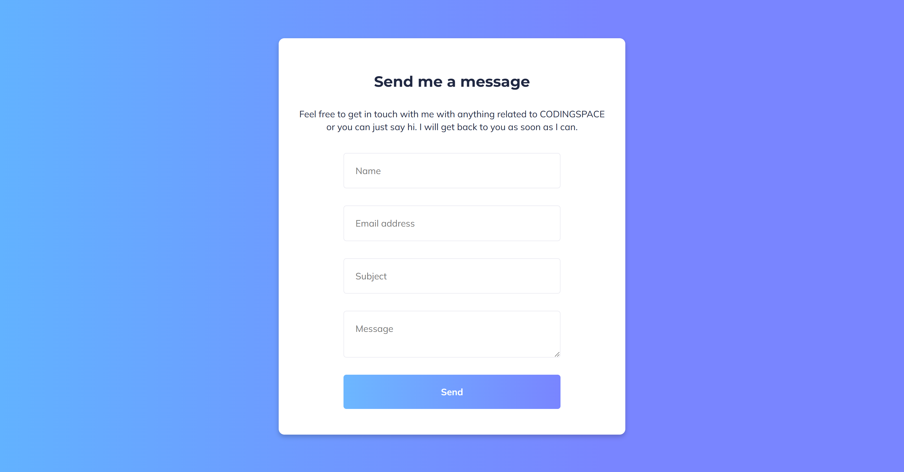

# Contact Form - FrontendPro Solution

This is a **responsive contact form** built with HTML, CSS, and JavaScript. It was created as a coding challenge on [FrontendPro](https://www.frontendpro.dev/frontend-coding-challenges/contact-us-form-uE4XYJicVTKtJp7FS4HX) and demonstrates a clean, user-friendly design with client-side form validation.

## Features

- **Responsive Layout**: Adapts to different screen sizes.
- **Modern UI**: Styled with smooth gradients and rounded borders for a modern look.
- **Client-Side Validation**: JavaScript validation for fields like Name, Email, Subject, and Message.
- **Success & Error Messages**: Displays feedback to users on successful submission or validation errors.

## Technologies Used

- **HTML5**: Structure and form elements.
- **CSS3**: Styling with Flexbox, responsive design, gradients, and media queries.
- **JavaScript**: Form validation and feedback messages.

## Project Structure

```
project-root/
├── index.html         # HTML structure of the form
├── style.css          # Styling for the form and layout
├── script.js          # JavaScript for form validation and user feedback
├── README.md          # Project documentation
```

## Getting Started

To view and interact with this contact form:

1. **Clone this repository**:
   ```bash
   git clone https://gitlab.com/Yashi-Singh-9/contact-us-form-frontendpro.git
   ```

2. **Navigate to the project directory**:
   ```bash
   cd contact-form-frontendpro
   ```

3. **Open `index.html`** in a web browser to view the contact form.

## Usage

- Enter your **Name**, **Email Address**, **Subject**, and **Message** in the form fields.
- Click **Send** to submit the form.
- If any field is invalid:
  - An error message will display below the respective field.
- If all fields are valid:
  - A success message will display, and the form will reset.

## Form Validation Details

The form validates user input as follows:

- **Name**: Required field. Displays "Name is required" if left empty.
- **Email**: Required field, must follow a standard email format. Displays "Email is required" or "Please enter a valid email address."
- **Subject**: Required field. Displays "Subject is required" if left empty.
- **Message**: Required field. Displays "Message is required" if left empty.

If all fields pass validation, a success message "Message sent successfully!" is displayed, and the form is reset.

## Customization

To modify the form:

- **Styles**: Edit `style.css` for colors, fonts, and layout changes.
- **Validation Logic**: Modify `script.js` if you want to add more complex validation or additional fields.

## Live Demo

Please do watch the live demo of Contact Us Form ;- [https://contact-form-frontendpro.netlify.app/](https://contact-form-frontendpro.netlify.app/)

## Screenshots

 

## Contributing 

For Contribution please refer [Contributing File](CONTRIBUTING.md)

## License

This project is open-source and free to use for educational or personal projects. Attribution to the original source (FrontendPro) is appreciated.

## Acknowledgments

- **FrontendPro** for providing the coding challenge inspiration.
- **Google Fonts** for the Montserrat and Mulish fonts used in this project.