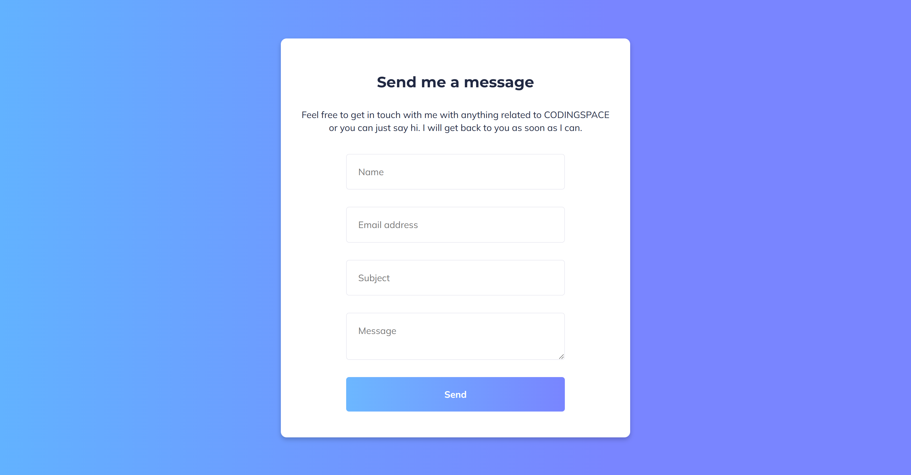
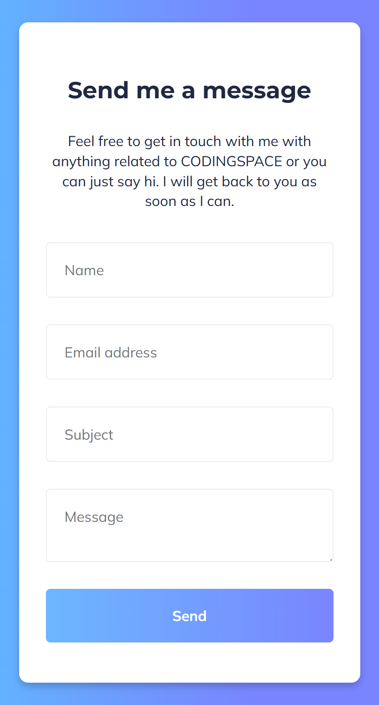

Here is an updated **README.md** file for your project that incorporates the use of SCSS and includes instructions on installing and running SCSS:

---

# Contact Form - FrontendPro Solution  

This is a **responsive contact form** built with HTML, SCSS, and JavaScript. It was created as a coding challenge on [FrontendPro](https://www.frontendpro.dev/frontend-coding-challenges/contact-us-form-uE4XYJicVTKtJp7FS4HX) and demonstrates a clean, user-friendly design with client-side form validation.

## Features  

- **Responsive Layout**: Adapts to different screen sizes.  
- **Modern UI**: Styled with SCSS for better modularity, smooth gradients, and rounded borders for a modern look.  
- **Client-Side Validation**: JavaScript validation for fields like Name, Email, Subject, and Message.  
- **Success & Error Messages**: Displays feedback to users on successful submission or validation errors.  

## Technologies Used  

- **HTML5**: Structure and form elements.  
- **SCSS (Sassy CSS)**: Modular and nested styling for better maintainability.  
- **JavaScript**: Form validation and user feedback.  

## Project Structure  

```plaintext  
project-root/  
├── index.html         # HTML structure of the form  
├── style.scss         # Main SCSS file       
├── style.css          # Compiled CSS file from SCSS  
├── style.css.map      # Source map file for style.css  
├── script.js          # JavaScript for form validation and user feedback  
├── images/            # Images used in the project  
│   ├── logo.svg       # Favicon/logo  
│   ├── Desktop-Design.png  
│   └── Mobile-Design.png  
├── README.md          # Project documentation  
└── .gitignore         # Files and folders to ignore in version control  
```  

## Getting Started  

To view and interact with this contact form:  

### 1. Clone the repository  
```bash  
git clone https://github.com/Yashi-Singh-9/Contact-Us-Form---FrontendPro-Solution.git  
```  

### 2. Navigate to the project directory  
```bash  
cd Contact-Us-Form---FrontendPro-Solution  
```  

### 3. Install SCSS (if not already installed)  
Make sure you have **Node.js** and **npm** installed. Then install SCSS globally using:  
```bash  
npm install -g sass  
```  

### 4. Compile SCSS to CSS  
Run the following command to compile SCSS files into CSS:  
```bash  
sass scss/style.scss css/style.css  
```  

Alternatively, you can use the `--watch` flag for continuous compilation during development:  
```bash  
sass --watch scss/style.scss:css/style.css  
```  

### 5. Open the project in a browser  
Open `index.html` in a web browser to view the contact form.  

## Usage  

- Enter your **Name**, **Email Address**, **Subject**, and **Message** in the form fields.  
- Click **Send** to submit the form.  
- If any field is invalid:  
  - An error message will display below the respective field.  
- If all fields are valid:  
  - A success message will display, and the form will reset.  

## Form Validation Details  

The form validates user input as follows:  

- **Name**: Required field. Displays "Name is required" if left empty.  
- **Email**: Required field, must follow a standard email format. Displays "Email is required" or "Please enter a valid email address."  
- **Subject**: Required field. Displays "Subject is required" if left empty.  
- **Message**: Required field. Displays "Message is required" if left empty.  

If all fields pass validation, a success message "Message sent successfully!" is displayed, and the form is reset.  

## Customization  

- **Styles**: Modify `scss/style.scss` for colors, fonts, layout, and other design changes.  
  After making changes, recompile the SCSS into CSS.  
- **Validation Logic**: Modify `script.js` to add more complex validation or additional fields.  

## Live Demo  

Check out the live demo here: [https://contact-form-frontendpro.netlify.app/](https://contact-form-frontendpro.netlify.app/)  

## Screenshots  

**Desktop Design**  
  

**Mobile Design**  
  

## Contributing  

For contributions, please refer to the [Contributing File](CONTRIBUTING.md).  

## License  

This project is open-source and free to use for educational or personal projects. Attribution to the original source (FrontendPro) is appreciated.  

## Acknowledgments  

- **FrontendPro** for providing the coding challenge inspiration.  
- **Google Fonts** for the Montserrat and Mulish fonts used in this project.  
- **Scss** for simplifying the CSS workflow.  